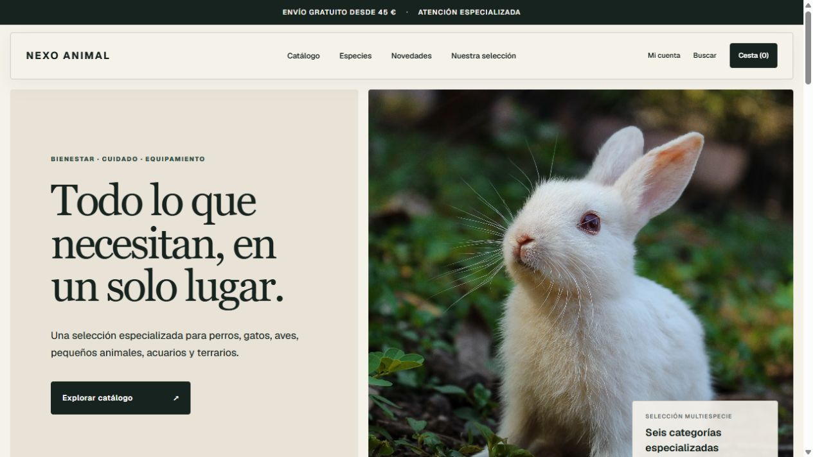
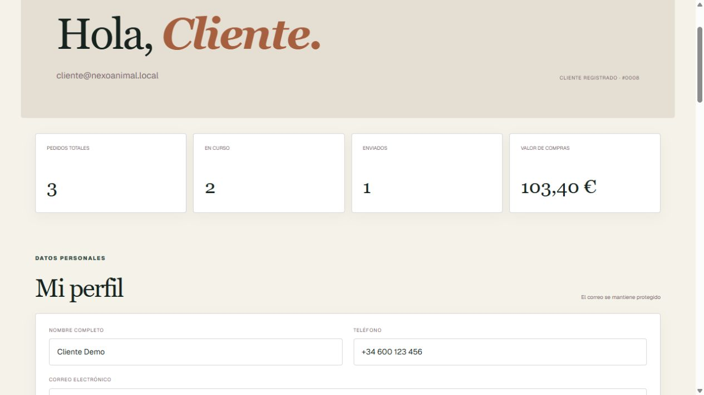
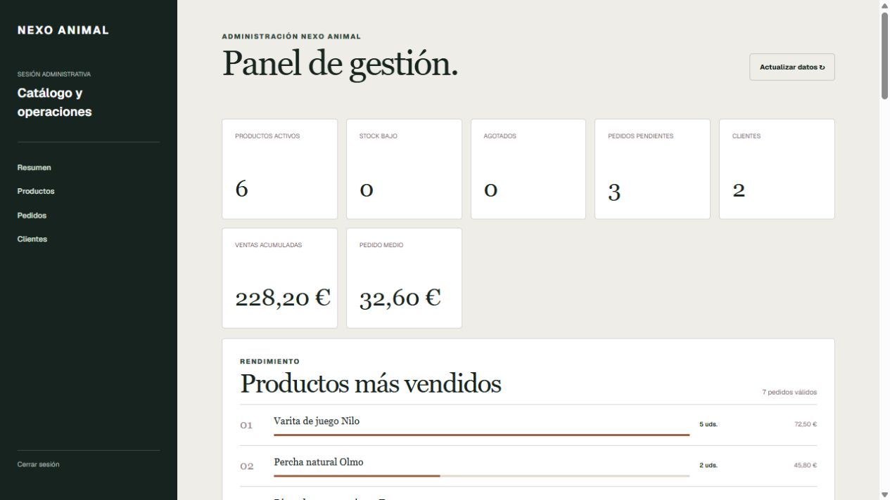
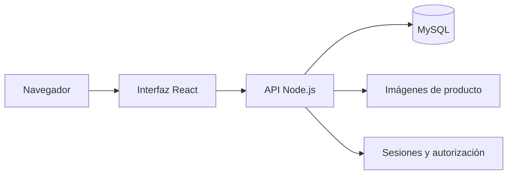

# Nexo Animal


Prototipo full-stack de comercio electrónico. El proyecto demuestra
un recorrido completo de compra, cuentas de cliente, gestión administrativa,
persistencia en MySQL y una API protegida, manteniendo una interfaz adaptable a
otros catálogos y modelos de tienda.

> Proyecto de portfolio. No procesa pagos reales ni debe utilizarse como comercio
> en producción sin completar las medidas indicadas en la hoja de ruta.

## Vista previa



| Área de cliente | Administración |
| --- | --- |
|  |  |

## Funcionalidades

### Tienda

- Catálogo multiespecie con búsqueda y filtros por categoría.
- Fichas individuales con metadatos sociales y SEO propios.
- Favoritos, cesta persistente y cálculo de envío gratuito.
- Checkout con validación de stock y creación transaccional del pedido.

### Área de cliente

- Registro, inicio y cierre de sesión mediante cookie `HttpOnly`.
- Perfil, teléfono, preferencias y cambio de contraseña.
- Favoritos, direcciones guardadas e historial de pedidos.
- Cronología de cada pedido, seguimiento y cancelación controlada.

### Administración

- Gestión de productos, categorías, imágenes, stock y visibilidad.
- Pedidos filtrables con estados y referencias de seguimiento.
- Fichas de clientes, métricas de actividad y bloqueo de cuentas.
- Indicadores de inventario, ventas y productos destacados.

## Tecnologías

| Capa | Tecnología |
| --- | --- |
| Interfaz | React 19, TypeScript, Vinext, Vite y CSS responsive |
| API | Node.js, rutas HTTP y validación en servidor |
| Datos | MySQL 8 y `mysql2/promise` |
| Seguridad | `scrypt`, cookies protegidas, rate limiting y cabeceras HTTP |
| Calidad | ESLint, TypeScript, Node Test Runner y GitHub Actions |

## Arquitectura



Las URL de la API están centralizadas en `lib/api.ts`. Los hooks `useApi`,
`useSession` y `useCart` separan el acceso a datos del resto de la interfaz,
facilitando una futura migración a Supabase sin rehacer todas las pantallas.

## Puesta en marcha

### Requisitos

- Node.js 22 o superior.
- MySQL 8 o MariaDB compatible.

### 1. Preparar el proyecto

```bash
git clone https://github.com/Nerby16/OnlineShopPrototype.git
cd OnlineShopPrototype
npm install
```

Copia `.env.example` como `.env` y configura las credenciales de MySQL y la
cuenta administrativa local.

### 2. Crear la base de datos

```bash
mysql -u root -p < database/schema.sql
```

El esquema crea las tablas y carga seis productos de demostración. Para una
instalación existente, ejecuta en orden los archivos de `database/migrations`.

### 3. Crear la demostración de cliente

```bash
npm run db:seed-demo
```

Esta tarea añade una cuenta de cliente, una dirección y pedidos representativos
sin duplicarlos si se ejecuta varias veces.

### 4. Iniciar la aplicación

```bash
npm run api
npm run dev
```

La tienda estará disponible en `http://localhost:3000` y la API en
`http://localhost:3001`. En Visual Studio Code, `Ctrl + Shift + B` inicia ambos
servicios utilizando la instalación de Node incluida en Laragon.

## Credenciales de demostración

### Cliente

- Correo: `cliente@nexoanimal.local`
- Contraseña: `nexo-animal-cliente-2026`

### Administración

La cuenta se genera con `ADMIN_EMAIL` y `ADMIN_PASSWORD` definidos en `.env`.
Los valores de `.env.example` son exclusivamente locales y deben sustituirse.

## Calidad y pruebas

```bash
npm run typecheck
npm run lint
npm test
```

La integración continua ejecuta estas comprobaciones automáticamente en cada
push y pull request dirigido a `main`. Las pruebas verifican compilación,
renderizado de rutas, metadatos, autenticación, cookies, firmas de imágenes y
la estructura de la capa de datos.

## Seguridad aplicada

- Contraseñas almacenadas con `scrypt`, sal aleatoria y comparación segura.
- Cookies `HttpOnly`, `SameSite=Strict`, prioridad alta y `Secure` en producción.
- Consultas parametrizadas y transacciones para pedidos e inventario.
- Límites de intentos por IP y cuenta en operaciones sensibles.
- Validación de origen, contenido JSON y datos recibidos por la API.
- Cabeceras contra clickjacking, interpretación de contenido y fuga de referencias.
- Imágenes limitadas a 5 MB y validadas por firma binaria.
- Secretos excluidos de Git mediante `.gitignore`.

## Estructura principal

```text
app/                  Interfaz, rutas y metadatos
database/             Esquema y migraciones MySQL
hooks/                Estado reutilizable de sesión, API y cesta
lib/                  Cliente HTTP y modelos compartidos
server/               API, autenticación y subida de imágenes
scripts/              Preparación de datos de demostración
tests/                Pruebas automatizadas
```

## Hoja de ruta

- Migrar MySQL, autenticación y almacenamiento a Supabase.
- Añadir recuperación y verificación de correo electrónico.
- Incorporar una pasarela de pago en entorno de pruebas.
- Añadir pruebas de navegador para los recorridos críticos.
- Realizar una auditoría nueva antes de cualquier uso en producción.

## Licencia

Distribuido bajo la licencia MIT. Consulta [LICENSE](LICENSE).
